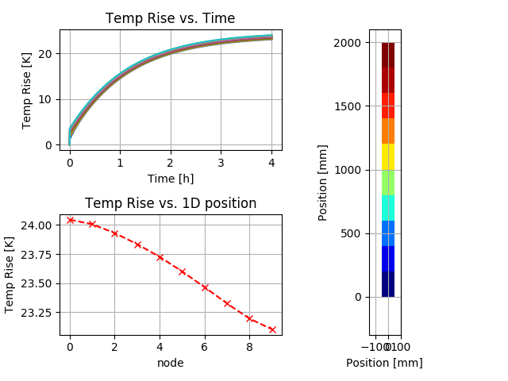

## Thermal Network Library

#### Documentation file for the **python** based library for solving heat distribution in air cooled electrical systems of conductors like switch gears, switch boards, distribution bars.

## The concept

The main idea of this library arise when I was working on some case study of temperature rise calculations for current carrying copper busbars.  At is basis all it does is to calculate the energy balance equation for a solid body with given heat source cooled in free air. Solution used in this tool is not intended to be as precise as CFD analysis can be. It is more focus on simplified (but not too much) engineering type analysis that is acceptable quick and can be used as a guide for design decision making. 

The solution takes into account all the major aspects of the energy transport in the system:

- Internal heat generation due to ohmic power losses

- Additional defined heat generation (to simulate other devices)

- Heat transfer between elements due to thermal conductivity

- Heat dissipation to ambient by radiation

- Heat dissipation to ambient by convection

- Ambient temperature modeling in proximity of objects (by **a**pproximate **a**ir **s**teady **s**tate **s**tatic **m**odel  - **aasssm**)

Used system defining methodology allows to build a 0 dimensional representation of quite complex 3D systems. 


## Main problem solving approach

To explain more in details how the solution approach is done it will be good to divide the entire process into some main steps:

1. System definition
   1. Definition of used materials
   2. Definition of basic system components ( ***nodes*** )
   3. Definition of analysis object - by set of ***nodes***
2. Solution definition
   1. Pre-solve model preparation
   2. Solver parameters setup
3. Solving
4. Results


Before we discuss more in details how each step works "under the hood" let's go through basic calculation script that do some solving for a very simple single copper conductor case.

### Simple script example

Firstly we will need to get our library functions available to use in the script. To make it possible some initial imports are done:

Import of the tnt library resources

```python
from thermalModelLibrary import tntObjects as tntO
from thermalModelLibrary import tntSolverObj as tntS
```

and some other common python libraries for drawing the plots and doing some little math around data plotting

```python
import matplotlib.pyplot as plt
import numpy as np
```

Having all required things imported we can move to pt.1.1 and define simple material

```python
Cu = tntO.Material()
```

  Using the material object constructor without any parameters it will return typical ***Copper*** material. Any other material can be generated, but this will be described in detailed doc.

Having this done we can move to pt.1.2 and define simple conductor ***node***

```python
conductor = tntO.thermalElement(
        	shape = tntO.shape(20,100,200,1,90), 
        	HTC = 5,
        	emissivity = 0.35,
        	dP = True,
        	source = 0,
        	material = Cu)
```

This create a single *conductor* node with a shape of box 20x100x200 [mm] with 1 such conductor in parallel and being oriented vertically to the top. This node is made of defined material of copper, have a emissivity of 0.35 and  Heat Transfer Coefficient of 5 [W/m^2^K]. 

This node will be solved for ohmic losses (dP = True), and have additional internal power source equal to 0.

We can move to pt.1.3 and define the object we want to analyze. Lets assume its a 2m long conductor build from the defined basic *conductor* node. to do this we will first prepare ***Elements*** a list that will describe such situation.

```python
Elements = [ (conductor, 10) ]
```

This notation just inform the library function that we want to have a 10 nodes of conductor type in serial one after another. To make this ready for solver some extra work need to be done. We need to run method that will do all necessary preparations for us doing:

Cloning our node object as independent ones as per defined shape:

```python
Elements = tntS.generateList(Elements) 
```

Doing ***node*** objects internal variables set up according to defined geometry

```python
tntS.elementsForObjSolver(Elements)
```

And finally having all geometry definitions and ***nodes*** preparations done we just need to calculate each node x,y position in space.

```python
tntS.nodePosXY(Elements)	
```

This conclude the preparations up to pt.2.1 

Is may seems quite a lot for such simple case. However if we extend the simulation to much more complex geometry and add additional connections between Objects like the above ***Elements*** all those steps will make more sens.

Having all above done we can set up the solver and run the simulation by saying:

```python
t,T,stp, linpos, XYpos, air = tntS.Solver(Elements, 2000, 20, 20, 4*60*60, 500,  0.01)
```

What it does is:

- solves for the geometry ***Elements***
- with current ***2000A~RMS~***
- with ambient temperature of ***20^o^C***
- with initial ***nodes*** temperature of ***20^o^C*** 
- for ***4h*** time ( 4h  * 60min * 60sec)
- with assumed solver time step of ***500s*** (this is auto adjusted in solver if needed)
- with single step accuracy ***0.01K*** (this is the maximum temperature change for any node in single time step)

Running this the Solver function returns to us:

- **t** - vector (list) of all time steps
- **T** - array (list of list) of temperatures of each ***node*** in each time step 
- **stp** - total number of solver time iterations needed to sole this
- **linpos** - vector (list) of each node **distance from previous**[mm] (not really useful anymore in current version)
- **XYpos** - position of each element in 2D space [mm] - Depreciated, now each ***node*** element object have x and y in internal variables 
- **air** - the tnt library air object used for solution (if was used. This is the default behavior of solver but can be altered)

Having all this data available we can take a look on the results. The below code is a summary of simple data preparations for display using matplotlib plotting library. So it will not be analyzed in details.

```python
# Rest is just cleaning up data for plotting
t = np.array(t) # changing list t into np array type
t = t / (60*60) # recalculating timesteps to hours

# preparing temp rises as results
b = np.array(T)
b = b - 20 # subtracting the ambient to get temperature rises

# defining the main plot window
fig = plt.figure('Temperature Rise Analysis ')

# first subplot for the timecurves
ax1 = fig.add_subplot(221)
ax1.plot(t,b[:,:])
ax1.set_title('Temp Rise vs. Time')
plt.ylabel('Temp Rise [K]')
plt.xlabel('Time [h]')

# Temperature rises from last timepoint for each node
ax2 = fig.add_subplot(223)
ax2.plot(b[-1,::-1],'rx--')
ax2.set_title('Temp Rise vs. 1D position')
plt.ylabel('Temp Rise [K]')
plt.xlabel('node')
ax1.grid()
ax2.grid()

# Defining the subplot for geometry heat map
ax3 = fig.add_subplot(122, aspect='equal')
# runs the defined procedure on this axis to draw the shape
tntS.drawElements(ax3,Elements,np.array(b[-1,:]))

plt.tight_layout()
plt.show()
```

Running that with python3 we shall get the result window:




Additionally each ***node*** element now have the following internal variables:

- ***node***.x - x position in [mm]
- ***node***.y - y position in [mm]
- ***node***.T - node temperature from last time step (end of solve)

### The solver general algorithm

```flow
st=>start: Start
op1=>operation: Read solution settings
op2=>operation: Prepare Air thermal model
setT=>operation: set initial time
setN=>operation: set 1st node
el=>operation: solve node
ne=>operation: set next node
c1=>condition: all nodes done?
test1=>operation: Check nodes results
c2=>condition: All temp rises in allowed limit?
c3=>condition: End time reached?
nt=>operation: set new smaller time step
nxt=>operation: set next time step
e=>end

st->op1->op2->setT->setN->el->c1
c1(no)->ne(right)->el
c1(yes)->c2
c2(no)->nt(right)->setN
c2(yes)->c3
c3(no)->nxt(right)->setN
c3(yes)->e
```
### Ambient temperature modeling in proximity of objects 

### **a**pproximate **a**ir **s**teady **s**tate **s**tatic **m**odel  - **aasssm**

What is this thing?

In principle to solve the case for each ***node*** element in each time step it's necessary to:

- calculate internal power generation ***Q~SRC~*** (ohmic losses plus defined additional power source)

- calculate the power dissipated to air via convection ***Q~conv~***

- calculate the power dissipated to air via radiation ***Q~rad~***

- calculate the power transferred via conduction from previous nodes ***Q~IN~***

- calculate the power transferred via conduction to next nodes ***Q~OUT~***

- solve the summary power balance for this time step 

  ***Q*** = ***Q~SRC~*** - ***Q~conv~*** - ***Q~rad~*** + ***Q~IN~*** - ***Q~OUT~***

- get the energy delta in the time step:

   ***E*** = ***Q*** ^.^ **$\Delta$time**  

- base on the element mass and material properties calculate the temperature rise ***$\Delta$T***

- if the result is smaller than the allowed by Solver configuration parameter we set the flag and move to next ***node*** element.

- when we done with all of ***nodes*** and all nodes solutions are within allowable limits we proceed to next time step. If not we repeat this time step with reduced ***$\Delta$T***  

For the calculations of ***Q~conv~*** and ***Q~rad~*** an ambient temperature value is needed. The simplest solution is to use a constant value of temperature. However for many cases this approach may be to simplified. In real scenario for devices that are enclosed in any type of enclosure we have air temperature being distributed vertically from coolest at the bottom to the hottest at the top. This is effect of the buoyancy force.  

To be able to in some approximation simulate this solver can apply two approaches:

-  Use a user defined ambient temperature as a function of height ***T~AMB~*** = ***f(h)*** 

- Use solver internal ***aasssm*** mechanism. 

The ***aasssm*** mechanism is activated if the solver parameter for ***T~AMB~*** is set to a numeric value.

How it works:

-  It's a static solution that is done before the transient solver starts. It's results is used for all further time steps.

- Simulated System is analyzed to get the size in height.

- 20 cells Air thermal network model is prepared for this height.

- each ***node*** element is mapped to proper Air cell based on its y position.

- Heat sources from each element are calculated (once) and added to Air heat input vector.

- Based on the predefined thermal conductances each Air cell temperature is calculated.

- To simulate (approximated) effect of temperature stratification the Air cell temperatures are sorted from coolest at the bottom to the hottest at the top.

     